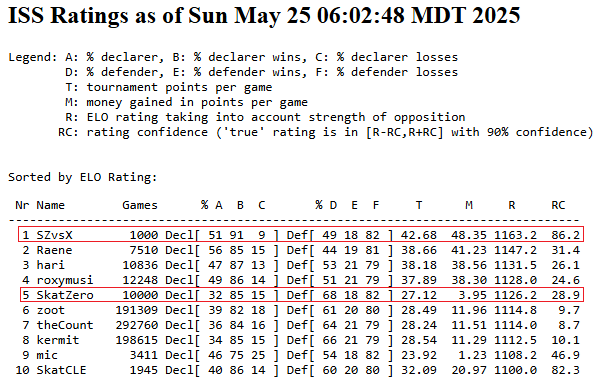
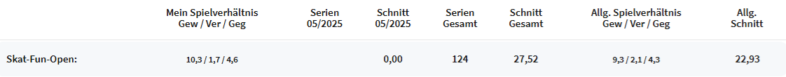

# SkatZero

[German Explanation](README_DE.md)

SkatZero is a reinforcement learning AI for the German card game [Skat](https://www.skatinsel.academy/en/how-to-skat/rules). In this 3-player card game, one of the players is up against two cooperating opponents, which makes this incomplete information game extremely challenging for AIs. Conventional AI algorithms exist (e.g., Kermit and variants), but are not on the level of expert players yet.  

This project uses Deep Monte Carlo reinforcement learning without prior knowledge of the game rules. That means it plays millions of games against itself, first with random moves and over time with more strategic gameplay. The results are promising. SkatZero is able to beat all conventional AIs and reach first place on the leaderboard of the International Skat Server (ISS). The time required to make a move is also extremely low (just a few milliseconds) due to the nature of neural networks.  

## Statistics and Benchmark

SkatZero was evaluated against the state of the art AI Kermit and the simple AI XSkat, which use conventional algorithms. The following image shows the rating on the [International Skat Server](https://skatgame.net/mburo/iss-ratings.html) after thousands of games.

  

"SZvsX" was an instance of SkatZero that played only against the weak XSkat AI. In the rating system on the ISS this led a convenient first place after 1000 games. SkatZero was able to play 51% of the hands as solo player and won 91% of those. The average Seeger-Fabian score per hand was 42.5 compared to 18.5 of XSkat.  

"SkatZero" was an instance of SkatZero that played 10000 games against Kermit, the previous state of the art AI. It reached an average Seeger-Fabian score of 27.1, compared to 25.1 of Kermit. Here are the detailed statistics:

  

SkatZero was also evaluated against human players on the Euroskat server. 124 series were played (9 to 36 games each) and the average Seeger-Fabian score per hand was 27.52 compared to the average of 22.93 of the human players in that format.  
It is important to note that the AI was only used on tables in the "free area" (without betting money). The level of play there is lower than on tables with real money on the line, against professional players SkatZero would perform not as great as this statistic suggests.

  

## Architecture

### Network Architecture

The architecture of the project is based on [DouZero](https://github.com/kwai/DouZero) for the chinese card game Dou Dizhu. Major changes were made for the features, card encoding and the game logic, while the network architecture is mostly the same (6-layer MLP, with the action and state of the game as input, as well as the historical moves preprocessed by an LSTM network). There are 3 models for each game type (Suit Game, Grand, Null), meaning a total of 9 models need to be trained. Details on the network architecture can be found in the [DouZero Paper](https://arxiv.org/pdf/2106.06135).  

#### Features
The features differ for the solo and opposing players, as well as game type. Everything is encoded as a one hot matrix.  
In general the features are the following:  
**Action**:  
`Card`  
**Game State**:  
`Current Hand`  
`Opponent Hand`  
`Card 1 in trick`  
`Card 2 in trick`  
`Cards in skat`  
`Missing Cards of other players`  
`Cards Played by other players`  
`Solo Player Points`  
`Opponent Points`  
`Information about bidding`  
`Is Blind Hand Game`  
**Game History**:  
`All cards and the player who played them in chronological order`  

### Bidding Architecture

Bidding was not the focus of the AI, but it was necessary to play games in the ISS against other AIs and evaluate the performance. Due to the complexity of the bidding process, it was not included in the actual AI itself, meaning the AI learns only which cards to discard in the actual game. A simple conventional algorithm was written for the bidding process, utilizing the expected win rate that the AI outputs for the first discard. Since the inference time is very low, it is feasible to simulate all possible hands (for all Skat pickups and putting down of 2 cards) in a reasonable time. This can be done for all 3 game types and is used to calculate how high to bid.  
The bidding algorithm is far from perfect, since it does not really take into account other player bids. An idea for the future would be to integrate bidding into the AI, or train another AI only for bidding (like it was done in [AlphaDou](https://arxiv.org/abs/2407.10279)).  

Another problem with not putting the bidding process into the AI itself is the inability to exactly determine what the bids of the players are and who wins the bid when training the AI. A fast, conventional algorithm is used for that, but results in inaccurate data which sometimes does not represent real world situation in the initial data, which is hindering the general learning process.

## Training

Training was done on a regular PC with one RTX 4070 Ti and an Intel Core i7-12700F. Only the learning process was run on the GPU, the actors that played the games were run on 16 cores (processes) on the CPU. The total training time was 500 hours each for the suit-game model and grand-game model. Each of those models played around 1.5 billion games in that time. The null-game model took less time to train, since the gameplay is simpler.

## Dependencies

- Pytorch

## Usage

### API

The API is probably the most useful way to interact with SkatZero.  
To get the AI move for a specific gamestate, run the following command:
```sh
python api.py ARGUMENTS
```

Arguments are described in the `api.py` file.

### Training

To train the models, run the following command:
```sh
python train.py
```
Most of the parameters in the file can usually be kept at the default. The target game mode as well as the number of actors should be changed depending on your hardware.

### Evaluation

To evaluate the trained models, run the following command:
```sh
python evaluate.py
```
This will let a specific version of a model play multiple games against another model, to check how much the performance increased.  
Modify the `evaluate.py` file to specify which models to evaluate against.

### Play

To play against the model locally (without bidding) in a simple text-based interface, run the following command:
```sh
python play.py
```
You can modify the `play.py` file to change the position of the human player (solo player by default).

### Tests

To start the tests, run the following command:
```sh
python test.py
```
There are testcases for each game mode ranging from simple to challenging puzzles.

## License
This project is licensed under the MIT License - see the LICENSE file for details.