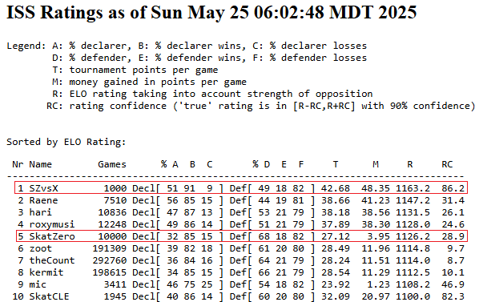
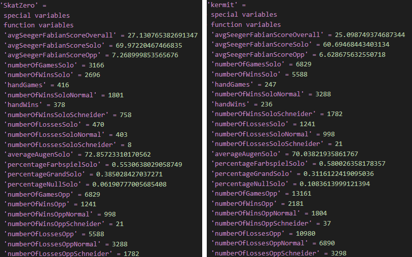
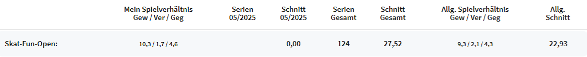

# SkatZero

[English Readme](README.md)

SkatZero ist eine Reinforcement-Learning-KI für das deutsche Kartenspiel [Skat](https://de.wikipedia.org/wiki/Skat). In diesem Kartenspiel mit drei Spielern spielt ein Spieler gegen zwei kooperierende Gegner, was es zu einem unvollständigen Informationsspiel macht und somit besonders herausfordernd für KIs. Es existieren zwar herkömmliche KI-Algorithmen (z.B. Kermit und Varianten), jedoch erreichen diese noch nicht das Niveau von menschlichen Experten.  

Dieses Projekt verwendet Deep Monte Carlo Reinforcement Learning ohne Vorwissen über die Spielregeln. Das bedeutet, dass es Millionen von Spielen gegen sich selbst spielt – zunächst mit zufälligen Zügen und im Verlauf mit immer strategischerem Spielverhalten. Die Ergebnisse sind vielversprechend: SkatZero ist in der Lage, alle herkömmlichen KIs zu schlagen und den ersten Platz in der Rangliste des International Skat Server (ISS) zu erreichen. Auch die Zeit zur Ausführung eines Spielzugs ist extrem gering (nur wenige Millisekunden), dank der Nutzung neuronaler Netze.

## Statistiken und Benchmark

SkatZero wurde gegen die aktuell führende KI Kermit sowie gegen die einfache KI XSkat getestet, welche auf klassischen Algorithmen basieren. Das folgende Bild zeigt die Bewertung auf dem [International Skat Server](https://skatgame.net/mburo/iss-ratings.html) nach Tausenden von Spielen:



„SZvsX“ war eine Instanz von SkatZero, die ausschließlich gegen die schwache XSkat-KI spielte. Aufgrund der Natur des Ranglistensystems auf dem ISS führte dies zu mehr ELO-Punkten und einem ersten Platz nach 1000 Spielen mit solidem Abstand. SkatZero bestritt 51 % der Spiele als Alleinspieler und gewann 91 % davon. Die durchschnittliche Seeger-Fabian-Punktzahl pro Spiel betrug 42,5 im Vergleich zu 18,5 bei XSkat.  

„SkatZero“ war eine Instanz, die 10.000 Spiele gegen Kermit spielte, die bisher führende KI. Die durchschnittliche Seeger-Fabian-Punktzahl lag bei 27,1 gegenüber 25,1 bei Kermit. Hier sind die detaillierten Statistiken:



SkatZero wurde auch gegen menschliche Spieler auf dem Euroskat-Server getestet. Es wurden 124 Serien gespielt (jeweils 9 bis 36 Spiele), und die durchschnittliche Seeger-Fabian-Punktzahl pro Spiel lag bei 27,52, verglichen mit 22,93 bei den menschlichen Spielern in diesem Format.  
Es ist wichtig zu betonen, dass die KI nur an Tischen im „freien Bereich“ (ohne Geldeinsätze) eingesetzt wurde. Das Spielniveau ist dort niedriger als an Tischen mit echtem Geld. Gegen professionelle Spieler würde SkatZero wahrscheinlich nicht so gut abschneiden, wie diese Statistik vermuten lässt.



## Architektur

### Netzwerkarchitektur

Die Architektur des Projekts basiert auf [DouZero](https://github.com/kwai/DouZero) für das chinesische Kartenspiel Dou Dizhu. Es wurden wesentliche Änderungen an den Features, der Kartenkodierung und der Spiel-Logik vorgenommen, während die Netzwerkarchitektur größtenteils gleich geblieben ist (6-schichtiges MLP, mit dem Spielzustand und der Aktion als Input sowie einer LSTM-Vorverarbeitung der bisherigen Spielzüge).  
Es gibt 3 Modelle pro Spieltyp (Farbspiel, Grand, Null), also müssen insgesamt 9 Modelle trainiert werden. Details zur Netzwerkarchitektur finden sich im [DouZero-Paper](https://arxiv.org/pdf/2106.06135).

#### Features

Die Features unterscheiden sich je nach Spielerrolle (Alleinspieler oder Gegenspieler) sowie Spieltyp. Alle Daten werden als One-Hot-Matrix kodiert.  
Im Allgemeinen sind die Features wie folgt:

**Aktion**:  
- `Karte`  

**Spielzustand**:  
- `Aktuelle Hand`  
- `Hand des Gegners`  
- `Karte 1 im Stich`  
- `Karte 2 im Stich`  
- `Karten im Skat`  
- `Fehlende Karten der anderen Spieler`  
- `Gespielte Karten der anderen Spieler`  
- `Punkte des Alleinspielers`  
- `Punkte der Gegner`  
- `Informationen zur Reizung`  
- `Handspiel?`  

**Spielverlauf**:  
- `Alle gespielten Karten mit zugehörigem Spieler in chronologischer Reihenfolge`  

### Reizarchitektur

Das Reizen war nicht der Fokus der KI, aber es war notwendig, um Spiele auf dem ISS gegen andere KIs zu spielen und die Performance zu evaluieren. Aufgrund der Komplexität des Reizvorgangs wurde dieser nicht in die eigentliche KI integriert. Die KI lernt also nur, welche Karten im Spiel auszuspielen sind. Ein einfacher konventioneller Algorithmus wurde für das Reizen geschrieben, der die erwartete Gewinnwahrscheinlichkeit nutzt, die die KI beim ersten Drücken ausgibt.  
Da die Inferenzzeit sehr gering ist, können alle möglichen Hände (mit allen Skataufnahmen und Drückung von 2 Karten) in akzeptabler Zeit simuliert werden. Das kann für alle 3 Spieltypen erfolgen und dient dazu, die eigene Reizung zu bestimmen.  

Der Reizalgorithmus ist bei weitem nicht perfekt, da er die Reizungen der anderen Spieler kaum berücksichtigt. Eine Idee für die Zukunft wäre, das Reizen in die KI zu integrieren oder eine eigene KI nur fürs Reizen zu trainieren (wie z.B. bei [AlphaDou](https://arxiv.org/abs/2407.10279)).  

Ein weiteres Problem, das durch die Auslagerung des Reizprozesses entsteht, ist die mangelnde Genauigkeit bei der Bestimmung der Gewinner des Reizvorgangs während des KI-Trainings. Ein schneller, konventioneller Algorithmus wird dafür verwendet, liefert aber ungenaue Daten, die nicht immer die reale Situation widerspiegeln – dies behindert den allgemeinen Lernprozess der KI.

## Training

Das Training erfolgte auf einem handelsüblichen PC mit einer RTX 4070 Ti und einem Intel Core i7-12700F. Nur der Lernprozess lief auf der GPU, die Akteure, die die Spiele spielten, liefen parallel auf 16 CPU-Kernen (Prozesse).  
Die Trainingszeit betrug jeweils 500 Stunden für das Farbspiel- und das Grandspiel-Modell. In dieser Zeit spielte jedes dieser Modelle rund 1,5 Milliarden Spiele.  
Das Nullspiel-Modell benötigte aufgrund des einfacheren Spielverlaufs weniger Zeit.

## Abhängigkeiten

- Pytorch

## Nutzung

### API

Die API ist der beste Weg, um mit der KI zu interagieren.
Mit dem folgenden Befehl kann man die Aktion der KI für einen spezifischen Spielstatus erhalten:
```sh
python api.py ARGUMENTS
```

Die Argumente sind in der Datei `api.py` beschrieben.

### Training

Mit folgendem Befehl können die Modelle trainiert werden:  

```sh
python train.py
```

Die meisten Parameter in der Datei können in der Regel unverändert bleiben. Lediglich der zu trainierende Spielmodus, sowie die Anzahl der Akteure sollte an die eigene Hardware angepasst werden.

### Evaluation

Mit folgendem Befehl können die Modelle evaluiert werden:

```sh
python evaluate.py
```

Dabei lässt man eine bestimmte Modellversion mehrere Spiele gegen ein anderes Modell spielen, um die Performance zu überprüfen.
Um die Modelle festzulegen, die evauliert werden muss die `evaluate.py` Datei bearbeitet werden.

### Spielen

Mit folgendem Befehl kann lokal gegen das Modell gespielt werden (ohne Reizen), in einem simplen textbasierten Interface:

```sh
python play.py
```
In der `play.py` Datei kann man festlegen, an welcher Position der menschliche Spieler spielt (Standard: Alleinspieler).  

### Tests

Mit folgendem Befehl können Tests ausgeführt werden:

```sh
python test.py
```

Es gibt Testfälle für jeden Spielmodus, von einfachen bis zu komplexen Rätseln.

## Lizenz

Dieses Projekt steht unter der MIT-Lizenz – siehe die LICENSE-Datei für weitere Informationen.